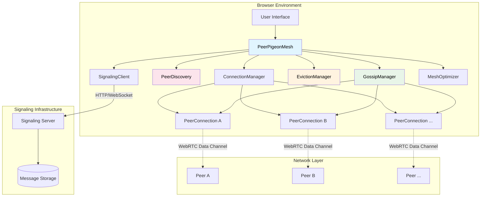
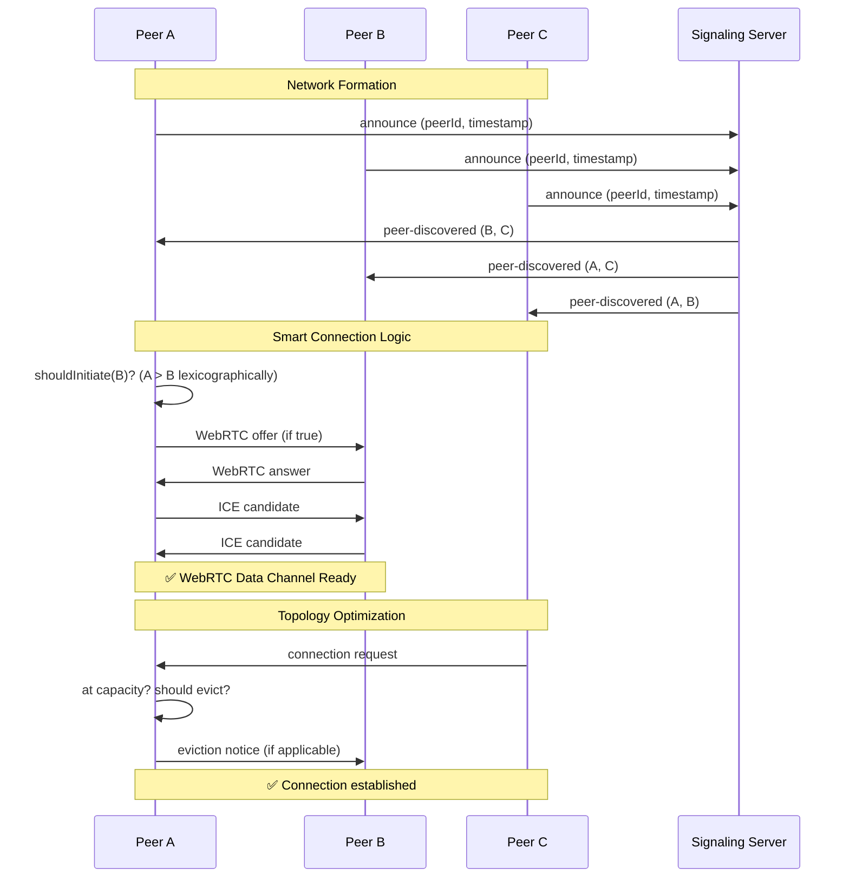
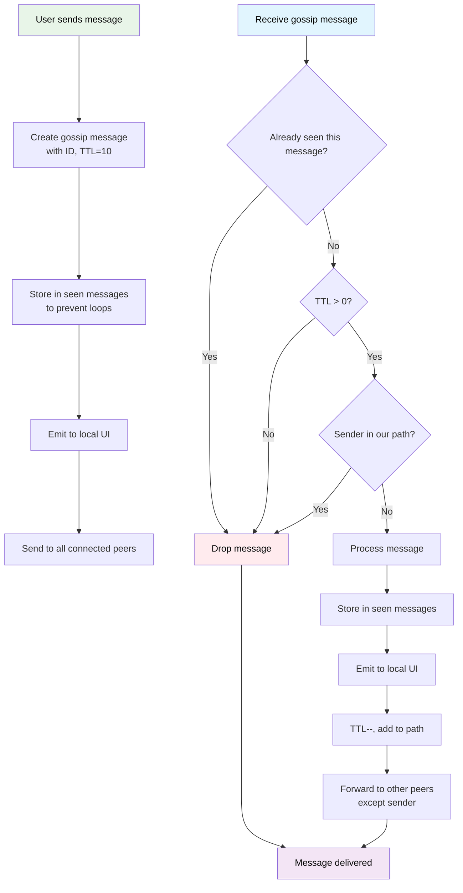
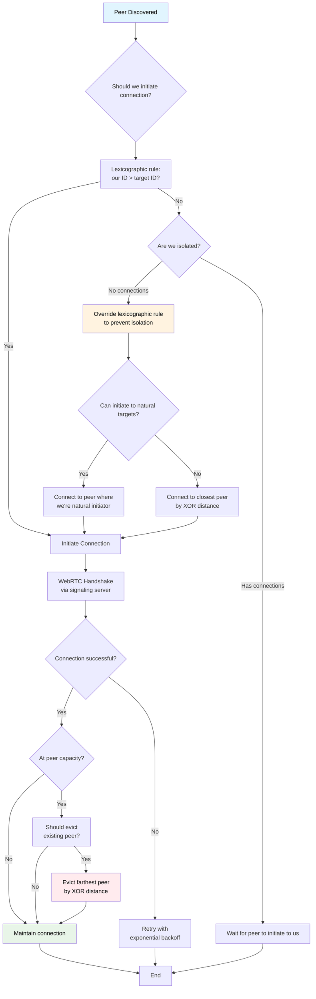
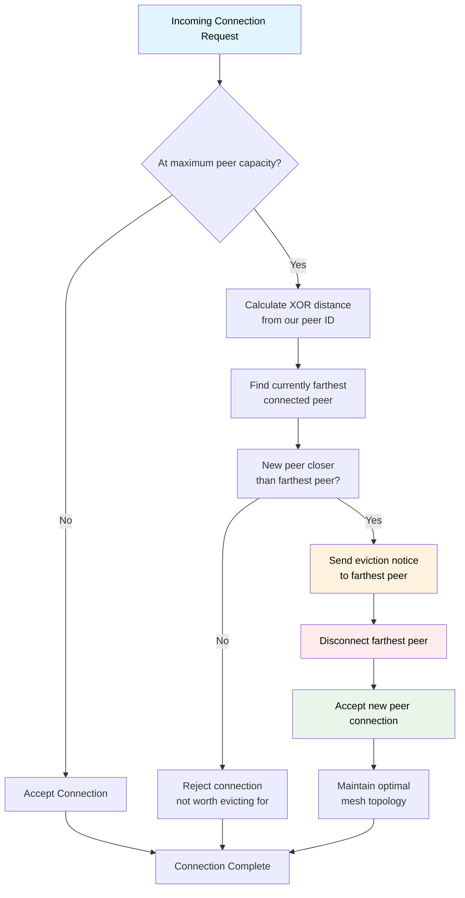
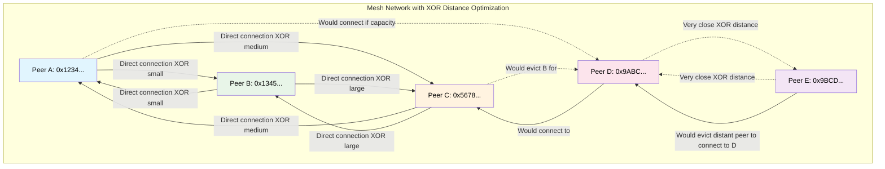

# PeerPigeon 

**A WebRTC-based peer-to-peer mesh networking library with intelligent routing, gossip protocol messaging, and automated peer management.**

[](https://badge.fury.io/js/peerpigeon)
[](https://opensource.org/licenses/MIT)
[](https://github.com/draeder/peerpigeon)
[](https://github.com/draeder/peerpigeon)

> **📊 Viewing Diagrams**: This README contains Mermaid diagrams. For proper visualization in VS Code, install the [Markdown Preview Mermaid Support](https://marketplace.visualstudio.com/items?itemName=bierner.markdown-mermaid) extension.

## 🌟 Features

- **🕸️ True Mesh Networking**: Gossip protocol ensures messages reach all peers, not just direct connections
- **🌐 Network Namespaces**: Create isolated peer networks with automatic global fallback
- **📐 XOR Distance Routing**: Kademlia-inspired peer selection for optimal network topology  
- **🧠 Smart Eviction Strategy**: Automatically replaces distant peers with closer ones to optimize mesh topology
- **🔍 Auto-Discovery**: Seamlessly connects to peers as they join the network
- **⚡ WebSocket Signaling**: Real-time bidirectional communication for optimal performance
- **🗄️ WebDHT (Low-Level DHT)**: Simple distributed hash table for raw key-value storage across the mesh
- **📦 DistributedStorageManager (High-Level)**: Encrypted, access-controlled storage with CRDT support for collaborative editing
- **🎥 Media Streaming**: Built-in support for audio/video streaming between peers
- **💬 Messaging System**: Direct messages and broadcast gossip protocol messaging
- **🔧 Modular Architecture**: Clean separation of concerns with event-driven components
- **💰 Cost-Optimized**: XOR-based routing reduces signaling server costs by ~95%
- **🛡️ Memory Safe**: Comprehensive cleanup prevents memory leaks in long-running applications

**Quick Links:**
- [Live Demo](http://localhost:8080/examples/browser/) (after starting local server)
- [Browser Examples](examples/browser/) - Complete web-based examples
- [Node.js Examples](examples/node/) - Server-side examples  
- [NativeScript Examples](examples/nativescript/) - Mobile app examples
- [API Documentation](API_DOCUMENTATION.md)
- [Network Namespaces Guide](NETWORK_NAMESPACES.md) - Named network segregation with global fallback
- [Selective Streaming Guide](SELECTIVE_STREAMING_GUIDE.md) - Media streaming optimization guide
- [CLI Documentation](CLI_README.md) - Command line interface guide
- [GitHub Issues](https://github.com/draeder/peerpigeon/issues)

## 🏗️ Architecture Overview



> **Note**: If diagrams don't display, install the [Markdown Preview Mermaid Support](https://marketplace.visualstudio.com/items?itemName=bierner.markdown-mermaid) extension in VS Code.

## 🚀 Quick Start

### Installation

```bash
# Install PeerPigeon from npm
npm install peerpigeon
```

### Basic Setup

```javascript
import { PeerPigeonMesh } from 'peerpigeon';

// Create mesh instance
const mesh = new PeerPigeonMesh({
    enableWebDHT: true, // Enable low-level distributed hash table (default: true)
    enableCrypto: true, // Enable encryption features (default: true)
    peerId: 'custom-peer-id' // Optional: provide custom peer ID
});

// Initialize and connect
await mesh.init();
await mesh.connect('ws://localhost:3000'); // Your signaling server URL
```

### Starting a WebSocket Server

#### Option 1: Programmatic Server Setup (Recommended)

```javascript
import { PeerPigeonServer } from 'peerpigeon';

// Create and start the server
const server = new PeerPigeonServer({
    port: 3000,
    host: 'localhost',
    maxConnections: 1000,
    cleanupInterval: 60000, // 1 minute
    peerTimeout: 300000     // 5 minutes
});

// Start the server
await server.start();

// Listen for events
server.on('peerConnected', ({ peerId, totalConnections }) => {
    console.log(`Peer ${peerId} connected. Total: ${totalConnections}`);
});

server.on('peerDisconnected', ({ peerId, totalConnections }) => {
    console.log(`Peer ${peerId} disconnected. Total: ${totalConnections}`);
});

// Graceful shutdown
process.on('SIGINT', async () => {
    await server.stop();
    process.exit(0);
});
```

#### Option 2: Standalone Server

```bash
# Run the standalone server (from npm package)
npm start

# Or run directly with custom configuration
PORT=8080 HOST=0.0.0.0 npm start
```

### Messaging Examples

```javascript
// Send a broadcast message to all peers
const messageId = mesh.sendMessage('Hello, mesh network!');

// Send a direct message to a specific peer
const directMessageId = mesh.sendDirectMessage('target-peer-id', 'Private message');

// Listen for incoming messages
mesh.addEventListener('messageReceived', (data) => {
    console.log(`Message from ${data.from}: ${data.content}`);
    console.log(`Direct message: ${data.direct}`);
});
```

### Standard Event Methods

PeerPigeon supports both traditional event methods and standard Node.js EventEmitter compatible methods:

```javascript
// Standard Node.js EventEmitter style (with method chaining)
mesh
    .on('connected', () => console.log('🔗 Connected!'))
    .on('peerConnected', (data) => console.log(`👋 Peer: ${data.peerId}`))
    .on('messageReceived', (data) => console.log(`💬 ${data.content}`));

// One-time listeners (auto-removed after first call)
mesh.once('initialized', () => {
    console.log('🎉 Mesh is ready!');
});

// Remove specific listeners
const messageHandler = (data) => console.log(data.content);
mesh.on('messageReceived', messageHandler);
mesh.off('messageReceived', messageHandler);

// Remove all listeners for an event
mesh.removeAllListeners('peerConnected');

// Get listener information
console.log(`Active events: ${mesh.eventNames()}`);
console.log(`Message listeners: ${mesh.listenerCount('messageReceived')}`);
```

### 🐛 Debug Configuration

PeerPigeon includes a comprehensive debug system that allows you to control console output at a granular level. **By default, all console logging is disabled** to prevent noise in production.

```javascript
import { PeerPigeonMesh, DebugLogger } from 'peerpigeon';

// Enable debugging for specific modules
DebugLogger.enableModules(['GossipManager', 'ConnectionManager']);

// Enable all debugging (development mode)
DebugLogger.enableAll();

// Enable debugging conditionally
if (process.env.NODE_ENV === 'development') {
  DebugLogger.enableAll();
}

// Create your mesh with debug output enabled
const mesh = new PeerPigeonMesh(options);
```

**Available Debug Modules:**
- `PeerPigeonMesh` - Main mesh lifecycle events
- `GossipManager` - Message propagation debugging  
- `ConnectionManager` - Peer connection management
- `PeerConnection` - Individual WebRTC connections
- `WebDHT` - Distributed hash table operations
- `CryptoManager` - Encryption operations
- `MediaManager` - Audio/video streaming
- And many more...

See [docs/DEBUG.md](docs/DEBUG.md) for complete documentation.

## 📚 Storage Architecture: WebDHT vs DistributedStorageManager

PeerPigeon provides **two separate storage systems** for different use cases:

### 🔧 WebDHT (Low-Level)
**Raw distributed hash table for simple key-value storage**
- Direct DHT operations across the mesh
- No encryption or access control
- Basic Kademlia-style routing and replication
- Use for simple data sharing or building custom storage

### 🛡️ DistributedStorageManager (High-Level)  
**Encrypted storage with access control and advanced features**
- Built on top of WebDHT as storage backend
- Encryption, access control, storage spaces
- CRDT support for collaborative editing
- Use for application data and user content

**Important**: These are separate systems. DistributedStorageManager uses WebDHT as its backend, but you can use either independently depending on your needs.

### WebDHT (Distributed Hash Table) Examples

```javascript
// Store data in the distributed hash table
await mesh.dhtPut('user-settings', { theme: 'dark', language: 'en' });

// Retrieve data from the DHT
const settings = await mesh.dhtGet('user-settings');

// Subscribe to changes
await mesh.dhtSubscribe('shared-counter');
mesh.addEventListener('dhtValueChanged', (data) => {
    console.log(`Key ${data.key} changed to:`, data.newValue);
});

// Update a value and notify subscribers
await mesh.dhtUpdate('shared-counter', 42);
```

### Distributed Storage Layer Examples

```javascript
// Crypto is enabled by default, but can be explicitly set
const mesh = new PeerPigeonMesh({
    enableCrypto: true, // Default: true, set to false to disable
    enableWebDHT: true
});

await mesh.cryptoManager.init();
await mesh.connect('ws://localhost:3000');

// Store private encrypted data
await mesh.distributedStorage.store('user:profile', {
    name: 'Alice',
    email: 'alice@example.com'
}, {
    isPublic: false,      // Private (encrypted)
    isImmutable: false    // Mutable for owner
});

// Store public data
await mesh.distributedStorage.store('app:config', {
    version: '1.0.0',
    features: ['chat', 'files']
}, {
    isPublic: true,       // Public (not encrypted)
    isImmutable: true     // Immutable for other peers
});

// Store collaborative document with CRDT
await mesh.distributedStorage.store('doc:shared', {
    title: 'Shared Document',
    content: 'Initial content'
}, {
    isPublic: true,
    enableCRDT: true      // Enable collaborative editing
});

// Grant access to private data
await mesh.distributedStorage.grantAccess('user:profile', otherPeer.peerId);

// Retrieve data
const profile = await mesh.distributedStorage.retrieve('user:profile');

// Update data (owner only, or CRDT-enabled)
await mesh.distributedStorage.update('user:profile', {
    name: 'Alice Smith',
    email: 'alice.smith@example.com'
});

// Listen for storage events
mesh.addEventListener('storageDataUpdated', (event) => {
    console.log(`Data updated: ${event.key} (version ${event.version})`);
});
```

### Media Streaming Examples

```javascript
// Start local video stream
const stream = await mesh.startMedia({ video: true, audio: true });

// Toggle media
mesh.toggleVideo(); // Enable/disable video
mesh.toggleAudio(); // Enable/disable audio

// Get media devices
const devices = await mesh.enumerateMediaDevices();
console.log('Available cameras:', devices.cameras);
console.log('Available microphones:', devices.microphones);

// Listen for remote streams
mesh.addEventListener('remoteStream', (data) => {
    const { peerId, stream } = data;
    const videoElement = document.createElement('video');
    videoElement.srcObject = stream;
    videoElement.play();
});
```

### Event Handling Examples

```javascript
// Connection events
mesh.addEventListener('connected', () => {
    console.log('Connected to signaling server');
});

mesh.addEventListener('peerConnected', (data) => {
    console.log(`Peer connected: ${data.peerId}`);
});

mesh.addEventListener('peerDisconnected', (data) => {
    console.log(`Peer disconnected: ${data.peerId}, reason: ${data.reason}`);
});

// Status monitoring
mesh.addEventListener('statusChanged', (data) => {
    console.log(`Status: ${data.type} - ${data.message}`);
});
```

### Configuration Examples

```javascript
// Adjust mesh topology
mesh.setMaxPeers(5);     // Maximum peer connections
mesh.setMinPeers(2);     // Minimum peer connections
mesh.setXorRouting(true); // Enable XOR-based routing
mesh.setEvictionStrategy(true); // Enable smart peer eviction

// Get current status
const status = mesh.getStatus();
console.log('Connected peers:', status.connectedCount);
console.log('Discovered peers:', status.discoveredCount);
```

### Local Development Server

**Option 1: Using npm package (Recommended)**
```bash
# Install PeerPigeon globally or in your project
npm install peerpigeon

# Start the signaling server
npm start

# Or with custom configuration
PORT=8080 HOST=0.0.0.0 npm start

# Serve the browser examples using the built-in server
npm run dev
```

**Option 2: From source (for development)**
```bash
# Clone the repository
git clone https://github.com/draeder/peerpigeon.git
cd peerpigeon

# Start the WebSocket signaling server
npm start

# Serve the browser examples
npm run dev
```

#### Navigate to http://localhost:8080/examples/browser/

###### Test with query parameters
http://localhost:8080/examples/browser/?api=ws://localhost:3000

## 🔄 System Flow Diagrams

### Peer Discovery & Connection Flow



### Gossip Protocol Message Flow



### Peer Connection & Isolation Prevention



### Smart Eviction Strategy



## � API Reference

### PeerPigeonServer Class

When importing the server class, you can create and configure it programmatically:

```javascript
import { PeerPigeonServer } from 'peerpigeon';

const server = new PeerPigeonServer(options);
```

#### Constructor Options

- **`port`** (number) - Server port (default: 3000)
- **`host`** (string) - Server host (default: 'localhost')
- **`maxConnections`** (number) - Maximum concurrent connections (default: 1000)
- **`cleanupInterval`** (number) - Cleanup interval in ms (default: 60000)
- **`peerTimeout`** (number) - Peer timeout in ms (default: 300000)
- **`corsOrigin`** (string) - CORS origin (default: '*')
- **`maxMessageSize`** (number) - Max message size in bytes (default: 1MB)

#### Methods

- **`await server.start()`** - Start the server
- **`await server.stop()`** - Stop the server
- **`server.getStats()`** - Get server statistics
- **`server.getPeers()`** - Get list of connected peers

#### Events

- **`started`** - Server started
- **`stopped`** - Server stopped
- **`peerConnected`** - Peer connected
- **`peerDisconnected`** - Peer disconnected
- **`peerAnnounced`** - Peer announced
- **`peerGoodbye`** - Peer said goodbye
- **`error`** - Server error

#### Example: Custom Server Configuration

```javascript
import { PeerPigeonServer } from 'peerpigeon';

const server = new PeerPigeonServer({
    port: 8080,
    maxConnections: 500,
    cleanupInterval: 30000
});

server.on('peerConnected', ({ peerId, totalConnections }) => {
    console.log(`New peer: ${peerId}, Total: ${totalConnections}`);
});

await server.start();
```

### Client Library Exports

```javascript
import { PeerPigeonMesh, PeerPigeonServer } from 'peerpigeon';
```

- **`PeerPigeonMesh`** - Main mesh networking class (browser)
- **`PeerPigeonServer`** - WebSocket signaling server class (Node.js)
- **`PeerConnection`** - WebRTC peer connection wrapper
- **`SignalingClient`** - WebSocket signaling client
- **`WebDHT`** - Distributed hash table implementation

## �📚 Core Components

### PeerPigeonMesh
Central coordinator that manages all mesh networking functionality and orchestrates the component interactions.

```javascript
const mesh = new PeerPigeonMesh();
await mesh.init();
await mesh.connect('wss://your-signaling-server.com');

// Send message to entire network via gossip protocol
const messageId = mesh.sendMessage('Hello mesh network!');

// Get network status
const status = mesh.getStatus();
console.log(`Connected to ${status.connectedCount}/${status.maxPeers} peers`);

// Configure mesh behavior
mesh.setMaxPeers(10);
mesh.setAutoDiscovery(true);
mesh.setEvictionStrategy(true);
```

### PeerDiscovery
Manages peer discovery and implements smart connection logic with isolation prevention.

**Key Features:**
- **Lexicographic connection rule** prevents connection race conditions
- **Isolation override** ensures peers with no connections can still connect
- **XOR distance sorting** prioritizes closer peers for optimal topology
- **Connection attempt tracking** prevents duplicate connection attempts

```javascript
// Example of isolation override logic
if (currentConnectionCount === 0 && discoveredPeers.length > 0) {
    // Override lexicographic rule to prevent isolation
    // Priority: natural initiators > closest peer by XOR distance
}
```

### ConnectionManager
Manages WebRTC peer connections, handles signaling, and routes messages to appropriate handlers.

**Responsibilities:**
- WebRTC connection establishment and management
- Message routing to GossipManager and EvictionManager
- Connection state tracking and cleanup
- Retry logic with exponential backoff
- Race condition prevention

### GossipManager
Implements gossip protocol for reliable message propagation across the entire mesh network.

**Protocol Features:**
- **TTL (Time To Live)**: Messages expire after 10 hops to prevent infinite loops
- **Seen message tracking**: Prevents duplicate message processing
- **Path tracking**: Detects and prevents routing loops
- **Broadcast guarantee**: Messages reach all peers, not just direct connections

```javascript
// Gossip message structure
{
    id: 'unique-message-id',
    type: 'gossip',
    subtype: 'chat',
    content: 'Hello network!',
    from: 'sender-peer-id',
    timestamp: Date.now(),
    ttl: 10,
    path: ['sender-peer-id', 'relay-peer-id', ...]
}
```

### EvictionManager
Implements smart peer eviction for optimal mesh topology using XOR distance calculations.

**Eviction Strategy:**
- Only evicts when at maximum peer capacity
- Calculates XOR distances to determine peer relationships
- Evicts farthest peer when a closer one wants to connect
- Sends eviction notices before disconnecting peers
- No cooldown periods - focuses purely on topology optimization

### MeshOptimizer
Handles periodic mesh optimization and provides debugging utilities.

**Optimization Features:**
- Periodic connectivity analysis
- Force connection to all discovered peers (for testing)
- Mesh topology evaluation and recommendations

## ⚙️ Configuration & API

The PeerPigeonMesh API provides methods for configuration, network management, messaging, and debugging. It is designed to be intuitive and event-driven.

### Initialization & Connection
Methods to initialize the mesh and manage the connection to the signaling server.

```javascript
// Initialize the mesh with a new, cryptographically secure peer ID.
// This must be called before any other method.
await mesh.init();

// Connect to the signaling server to join the mesh network.
await mesh.connect(signalingUrl);

// Disconnect from the signaling server and all connected peers.
mesh.disconnect();
```

### Configuration
Configure the behavior of the mesh network. These setters can be called at any time.

```javascript
// Set the maximum number of concurrent peer connections.
// Default: 3, Min: 1, Max: 50
mesh.setMaxPeers(10);

// Set the minimum number of connections to maintain for network health.
// Default: 2, Min: 0, Max: 49
mesh.setMinPeers(2);

// Enable or disable automatic connection behavior when joining the mesh.
// Default: true
mesh.setAutoConnect(true);

// Enable or disable automatic connection to newly discovered peers.
// Default: true
mesh.setAutoDiscovery(true);

// Enable or disable the smart eviction strategy to optimize topology.
// Default: true
mesh.setEvictionStrategy(true);

// Enable or disable XOR distance-based routing for peer selection.
// Default: true
mesh.setXorRouting(true);

// Enable or disable the WebDHT (Distributed Hash Table) functionality.
// When disabled, all DHT methods will throw errors with helpful messages.
// Default: true (enabled)
// Can only be set during initialization in constructor options
const mesh = new PeerPigeonMesh({ enableWebDHT: false }); // Disable DHT

// Enable or disable encryption features (CryptoManager).
// Default: true (enabled)
// Can only be set during initialization in constructor options
const mesh2 = new PeerPigeonMesh({ enableCrypto: false }); // Disable crypto

// Set the signaling connection type. Currently only 'websocket' is supported.
// Default: 'websocket'
mesh.setConnectionType('websocket');
```

### Network & Peer Information
Retrieve information about the network state and connected peers.

```javascript
// Get a comprehensive status object with the current state of the mesh.
// See "Status Object Structure" below for details.
const status = mesh.getStatus();

// Get the number of currently connected peers.
const count = mesh.getConnectedPeerCount();

// Get an array of peer IDs for all connected peers.
const peers = mesh.getPeers();

// Get an array of peer IDs for all discovered but not-yet-connected peers.
const discovered = mesh.getDiscoveredPeers();

// Check if the mesh can accept new incoming connections (i.e., not at maxPeers).
const canAccept = mesh.canAcceptMorePeers();

// Check if a peer is currently connected.
const isConnected = mesh.hasPeer(peerId);
```

### Messaging
Send messages to other peers in the network.

```javascript
// Broadcast a message to the entire mesh network using the gossip protocol.
// Returns a unique ID for the message.
const messageId = mesh.sendMessage(content);
```

### Manual Peer Management
Manually control connections to specific peers.
```

### Event System

```javascript
// === Connection Events ===
mesh.addEventListener('peerConnected', (event) => {
    console.log(`✅ Peer connected: ${event.peerId.substring(0, 8)}...`);
});

mesh.addEventListener('peerDisconnected', (event) => {
    console.log(`❌ Peer disconnected: ${event.peerId.substring(0, 8)}... (${event.reason})`);
});

mesh.addEventListener('peerDiscovered', (event) => {
    console.log(`🔍 Peer discovered: ${event.peerId.substring(0, 8)}...`);
});

// === Messaging Events ===
mesh.addEventListener('messageReceived', (event) => {
    console.log(`💬 Message from ${event.from.substring(0, 8)}...: "${event.content}"`);
    console.log(`   Direct: ${event.direct}, Hops: ${event.hops || 0}`);
});

// === Network Events ===
mesh.addEventListener('peerEvicted', (event) => {
    console.log(`🔄 Peer evicted: ${event.peerId.substring(0, 8)}... (${event.reason})`);
});

mesh.addEventListener('statusChanged', (event) => {
    console.log(`📊 Status: ${event.type} - ${event.message}`);
});

mesh.addEventListener('peersUpdated', () => {
    console.log(`📈 Peer list updated - Connected: ${mesh.getConnectedPeerCount()}`);
});
```

### Status Object Structure

```javascript
const status = mesh.getStatus();
// Returns:
{
    peerId: "abc123...",              // Our peer ID
    connected: true,                  // Connected to signaling server
    connectedCount: 3,                // Number of connected peers
    discoveredCount: 5,               // Number of discovered peers
    maxPeers: 10,                     // Maximum peer limit
    minPeers: 2,                      // Minimum peer target
    autoDiscovery: true,              // Auto-discovery enabled
    evictionStrategy: true,           // Smart eviction enabled
    xorRouting: true,                 // XOR-based routing enabled
    connectionType: "websocket",      // Current signaling method
    signalingUrl: "wss://...",        // Signaling server URL
    uptime: 120000                    // Milliseconds since connection
}
```

## 🌐 Network Topology & XOR Routing

### XOR Distance Calculation

PeerPigeon uses XOR distance (inspired by Kademlia DHT) to determine peer relationships:

```javascript
// Example XOR distance calculation
function calculateXorDistance(peerId1, peerId2) {
    let distance = 0n;
    for (let i = 0; i < Math.min(peerId1.length, peerId2.length); i += 2) {
        const byte1 = parseInt(peerId1.substr(i, 2), 16);
        const byte2 = parseInt(peerId2.substr(i, 2), 16);
        const xor = byte1 ^ byte2;
        distance = (distance << 8n) | BigInt(xor);
    }
    return distance;
}

// Peer A: 0x1234abcd...
// Peer B: 0x1345cdef...
// XOR:    0x0071661e... (smaller = closer)
```

### Topology Example



### XOR Distance Benefits

1. **Optimal Peer Selection**: Peers with smaller XOR distances are preferred for connections
2. **Efficient Message Routing**: Gossip protocol naturally routes through relevant connections  
3. **Scalable Discovery**: New peers only notify the closest existing peers, reducing overhead
4. **Network Resilience**: Multiple paths through the mesh ensure message delivery
5. **Cost Optimization**: Reduces signaling server load by ~95% through smart peer targeting

### Isolation Prevention

The isolation prevention mechanism ensures network connectivity:

```javascript
// Isolation override logic in PeerDiscovery
if (currentConnectionCount === 0 && discoveredPeers.length > 0) {
    // Step 1: Try to connect to peers where we're the natural initiator
    const naturalInitiators = discoveredPeers.filter(peerId => this.peerId > peerId);
    
    if (naturalInitiators.length > 0) {
        // Connect to natural targets first
        return naturalInitiators.includes(targetPeerId);
    }
    
    // Step 2: If no natural targets, connect to closest peer by XOR distance
    const sortedByDistance = discoveredPeers.sort((a, b) => {
        const distA = calculateXorDistance(this.peerId, a);
        const distB = calculateXorDistance(this.peerId, b);
        return distA < distB ? -1 : 1;
    });
    
    return sortedByDistance[0] === targetPeerId;
}
```

## 🔗 WebSocket Signaling

PeerPigeon uses WebSocket signaling for real-time, bidirectional communication:

### WebSocket Signaling - Real-time Communication
- **Real-time delivery**: Instant bidirectional message delivery 
- **Cost-efficient**: Persistent connections reduce connection overhead
- **Modern browsers**: Chrome, Firefox, Safari, Edge with full support
- **Use case**: Production applications requiring real-time performance

```javascript
// WebSocket signaling is used by default
const mesh = new PeerPigeonMesh();
await mesh.connect('wss://your-websocket-server.com');

// WebSocket connection automatically handles:
// - Real-time peer discovery notifications
// - WebRTC signaling message delivery
// - Bidirectional communication
// - Connection state management
```

### WebSocket Protocol Messages

The WebSocket signaling supports these message types:

| Message Type | Purpose | Data Structure |
|--------------|---------|----------------|
| `announce` | Peer joins network | `{peerId, timestamp}` |
| `goodbye` | Peer leaves network | `{peerId, timestamp}` |
| `offer` | WebRTC connection offer | `{type: 'offer', data: RTCSessionDescription, targetPeerId}` |
| `answer` | WebRTC connection answer | `{type: 'answer', data: RTCSessionDescription, targetPeerId}` |
| `ice-candidate` | ICE candidate exchange | `{type: 'ice-candidate', data: RTCIceCandidate, targetPeerId}` |
| `cleanup` | Remove processed messages | `{type: 'cleanup', reason}` |

## 🚀 Deployment Options

### Option 1: Custom Signaling Server

Implement your own signaling server with these required endpoints:

```typescript
// Required endpoints for custom signaling server

// WebSocket connection endpoint
wss://your-server.com/signaling?peerId={peerId}

// WebSocket message format for all signaling messages:
{
    "type": "offer|answer|ice-candidate|announce|goodbye|ping",
    "data": "message-specific-data",
    "fromPeerId": "sender-peer-id",
    "targetPeerId": "recipient-peer-id", // optional for broadcasts
    "timestamp": 1234567890
}
```

### Option 2: Development/Testing Setup

For local development and testing:

```bash
For local development and testing:

```bash
# Serve with npm (preferred)
npm run dev

# Or with Node.js http-server
npm install -g http-server
http-server -p 8080
```

# Use query parameters to pre-configure signaling
open "http://localhost:8080/examples/browser/?api=wss://your-signaling-server.com/dev"
```

**Development Features:**
- Browser debugging tools integration
- Console logging with peer ID prefixes
- Global mesh access via `window.peerPigeonMesh`
- Force connection utilities for testing
- Real-time peer discovery and connection monitoring

## 🌐 Platform Compatibility & Requirements

### Supported Platforms

| Platform | Environment | WebRTC Support | WebSocket Support | Status |
|---------|-------------|----------------|-------------------|---------|
| **Web Browsers** | Modern browsers | ✅ Native | ✅ Native | **Full Support** |
| **Node.js** | Server-side | ⚠️ Via plugin | ✅ Via 'ws' | **Supported** |
| **NativeScript** | Mobile apps | ⚠️ Via plugin | ✅ Native/Plugin | **Supported** |
| **Web Workers** | Browser workers | ✅ Limited | ✅ Yes | **Basic Support** |

### Browser Compatibility

| Browser | Minimum Version | WebRTC Support | WebSocket Support | Status |
|---------|----------------|----------------|-------------------|---------|
| **Chrome** | 80+ | ✅ Full | ✅ Yes | **Recommended** |
| **Firefox** | 75+ | ✅ Full | ✅ Yes | **Recommended** |
| **Safari** | 14+ | ✅ Full | ✅ Yes | **Supported** |
| **Edge** | 80+ | ✅ Full | ✅ Yes | **Supported** |
| **Mobile Chrome** | 80+ | ✅ Full | ✅ Yes | **Supported** |
| **Mobile Safari** | 14+ | ✅ Full | ✅ Yes | **Supported** |

### Required Features
- **WebRTC**: RTCPeerConnection and RTCDataChannel support
- **ES6 Modules**: Dynamic imports and module syntax  
- **Crypto API**: For cryptographically secure peer ID generation
- **WebSocket API**: For real-time signaling communication

### NativeScript Support

PeerPigeon includes comprehensive NativeScript support:

```javascript
// NativeScript usage (same API as browser)
import { PeerPigeonMesh } from 'peerpigeon';

const mesh = new PeerPigeonMesh();
await mesh.init(); // Automatically detects NativeScript environment

// Environment detection
console.log('Environment:', mesh.environmentReport.runtime);
// { isNativeScript: true, platform: 'android' }
```

**NativeScript Features:**
- ✅ Environment detection with platform info (Android/iOS/visionOS)
- ✅ WebSocket signaling (native or via plugin)
- ✅ Storage management using NativeScript APIs
- ✅ Basic mesh networking capabilities
- ⚠️ WebRTC requires additional native plugins
- ⚠️ Media features require camera/microphone permissions

See the [NativeScript example](examples/nativescript/) for complete setup instructions.

### Feature Detection

PeerPigeon automatically detects browser capabilities:

```javascript
// Automatic capability detection
const mesh = new PeerPigeonMesh();
await mesh.init(); // Detects WebRTC, WebSocket support

// Check detected capabilities
const status = mesh.getStatus();
console.log('Connection type:', status.connectionType); // 'websocket'
console.log('WebRTC support:', mesh.hasWebRTCSupport());
console.log('WebSocket support:', mesh.hasWebSocketSupport());
```

## ⚡ Performance & Scalability

### Network Efficiency
- **Gossip TTL**: Messages expire after 10 hops to prevent network flooding
- **XOR Routing**: Only relevant peers receive discovery notifications (~95% reduction)
- **Connection Limits**: Configurable peer limits prevent resource exhaustion
- **Smart Eviction**: Maintains optimal topology without unnecessary reconnections

### Performance Metrics
Based on testing with browser networks:

| Network Size | Avg Connection Time | Message Delivery | Memory Usage |
|--------------|-------------------|------------------|--------------|
| 2-5 peers | < 2 seconds | 100% success | ~5MB per peer |
| 6-10 peers | 2-4 seconds | 99.8% success | ~8MB per peer |
| 11-15 peers | 3-6 seconds | 99.5% success | ~12MB per peer |

### Best Practices for Performance

1. **Optimal Peer Limits**
   ```javascript
   // For most applications
   mesh.setMaxPeers(8);  // Sweet spot for connectivity vs resources
   mesh.setMinPeers(3);  // Ensures network resilience
   ```

2. **Enable All Optimizations**
   ```javascript
   mesh.setEvictionStrategy(true);  // Maintains optimal topology
   mesh.setXorRouting(true);        // Reduces signaling overhead
   mesh.setAutoDiscovery(true);     // Handles connections automatically
   ```

3. **Monitor Connection Health**
   ```javascript
   mesh.addEventListener('statusChanged', (event) => {
       if (event.type === 'warning') {
           console.warn('Network issue:', event.message);
           // Implement reconnection logic
       }
   });
   ```

## 🔒 Security Considerations

### Built-in Security Features
- **Peer ID Generation**: Uses `crypto.getRandomValues()` for cryptographically secure peer IDs
- **WebRTC Encryption**: Built-in DTLS encryption for all peer-to-peer communication
- **Input Validation**: All peer IDs and messages are validated before processing
- **Message Limits**: TTL and size limits prevent abuse and resource exhaustion

### Deployment Security

#### Signaling Server Security
```bash
# Always use HTTPS/WSS for signaling endpoints
https://your-signaling-server.com/signaling  # ✅ Secure
http://your-signaling-server.com/signaling   # ❌ Insecure

# Implement rate limiting
POST /signaling
X-Rate-Limit: 100 requests per minute per IP
```

### Security Best Practices

1. **Validate All Inputs**
   ```javascript
   // PeerPigeon automatically validates:
   // - Peer ID format (hexadecimal, correct length)
   // - Message content (type, size limits)
   // - WebRTC message structure
   ```

2. **Implement Application-Level Security**
   ```javascript
   // Add your own message authentication
   mesh.addEventListener('messageReceived', (event) => {
       if (!validateMessageSignature(event.content, event.from)) {
           console.warn('Ignoring message with invalid signature');
           return;
       }
       // Process trusted message
   });
   ```

3. **Monitor for Abuse**
   ```javascript
   // Track message frequency per peer
   const messageRates = new Map();
   mesh.addEventListener('messageReceived', (event) => {
       const rate = trackMessageRate(event.from);
       if (rate > MAX_MESSAGES_PER_MINUTE) {
           mesh.disconnectPeer(event.from, 'rate limit exceeded');
       }
   });
   ```

## 🛠️ Development & Debugging

### Running Tests

```bash
# Install development dependencies
npm install

# Start local development server
npm run dev
# or
npx http-server -p 8080

# Open multiple browser tabs for testing
open http://localhost:8080/examples/browser/
open http://localhost:8080/examples/browser/
open http://localhost:8080/examples/browser/
```

### Debugging Tools

#### Built-in Debugging
```javascript
// Global mesh access in browser
window.peerPigeonMesh.getStatus();           // Network status
window.peerPigeonMesh.getPeers();            // Connected peers
window.peerPigeonMesh.getDiscoveredPeers();  // Discovered peers
window.peerPigeonMesh.debugConnectivity();   // Detailed connectivity info

// Force connections for testing
window.peerPigeonMesh.forceConnectToAllPeers();

// Component access
window.peerPigeonSignaling;    // SignalingClient instance
window.getPeerPigeonState();   // Complete application state
```

#### Browser Developer Tools
1. **Console Logs**: Detailed connection and message flow with peer ID prefixes
2. **Network Tab**: Monitor signaling server communication patterns
3. **WebRTC Internals**: Chrome's `chrome://webrtc-internals/` for connection debugging
4. **Application Tab**: LocalStorage inspection for persistent state

#### Debugging Common Issues

**Connection Problems:**
```javascript
// Check connection prerequisites
console.log('Signaling connected:', mesh.getStatus().connected);
console.log('Discovered peers:', mesh.getDiscoveredPeers().length);
console.log('Connection attempts:', mesh.getConnectionAttempts());

// Force retry connections
mesh.getDiscoveredPeers().forEach(peer => {
    if (!mesh.hasPeer(peer.peerId)) {
        mesh.connectToPeer(peer.peerId);
    }
});
```

**Message Delivery Issues:**
```javascript
// Check gossip protocol state
mesh.addEventListener('messageReceived', (event) => {
    console.log('Message path:', event.path);
    console.log('TTL remaining:', event.ttl);
    console.log('Seen messages:', mesh.gossipManager.seenMessages.size);
});
```

## 🧪 Testing & Development

PeerPigeon includes a comprehensive testing framework with unit tests, integration tests, performance benchmarks, and automated CI/CD pipeline.

### Quick Start

```bash
# Install dependencies
npm install

# Run all tests
npm test

# Run specific test suites
npm run test:unit          # Unit tests only
npm run test:integration   # Integration tests only
npm run test:custom        # Custom test runners

# Run with coverage
npm run test:coverage

# Performance benchmarks
npm run benchmark

# Linting
npm run lint
npm run lint:fix          # Auto-fix issues

# Full CI pipeline
npm run ci
```

### Test Structure

```
test/
├── unit/                 # Unit tests (16 tests)
│   ├── crypto.test.js    # CryptoManager tests (7 tests)
│   └── mesh.test.js      # PeerPigeonMesh tests (9 tests)
├── integration/          # Integration tests (7 tests)
│   ├── simple.test.js    # Integration scenarios
│   └── integration-runner.js # Custom test runner
├── setup.js              # Jest configuration
├── runner.js             # Comprehensive test runner
└── benchmark.js          # Performance benchmarks
```

### Testing Framework Features

- **🔧 Custom Test Runners**: Built-in Node.js test runners for comprehensive testing
- **🃏 Jest Integration**: Modern testing framework with ES modules support and coverage reporting
- **📊 Coverage Reports**: Detailed HTML and LCOV coverage reports
- **⚡ Performance Benchmarks**: Crypto operations, mesh performance, and memory usage
- **🔍 Linting**: ESLint with standard configuration (0 errors, 0 warnings)
- **🤖 CI/CD Pipeline**: Automated testing with proper resource cleanup
- **🛠️ Clean Test Termination**: All tests complete without hanging processes
- **⚡ Fast Execution**: Unit tests ~0.26s, full suite ~1.2s

### Available Commands

```bash
# Using npm scripts
npm test                  # Jest tests (23/23 passing)
npm run test:unit         # Unit tests (16/16 passing)
npm run test:integration  # Integration tests (7/7 passing)
npm run test:custom       # Custom test runners
npm run test:all          # Comprehensive test suite
npm run test:coverage     # Coverage analysis
npm run test:watch        # Watch mode
npm run lint              # ESLint (0 errors, 0 warnings)
npm run lint:fix          # Auto-fix linting issues
npm run benchmark         # Performance benchmarks
npm run ci                # Full CI pipeline

# Using Makefile (shorter commands)
make test                 # Run tests
make lint                 # Run linting
make benchmark            # Run benchmarks
make coverage             # Generate coverage
make ci                   # Full CI check
make help                 # Show all commands
```

### Test Categories

#### Unit Tests (16 tests passing)
- **CryptoManager (7 tests)**: Encryption, decryption, key generation, signing
- **PeerPigeonMesh (9 tests)**: Core mesh functionality, message routing
- **Resource Management**: Timer cleanup, proper disconnection
- **Memory Safety**: No memory leaks or hanging processes

#### Integration Tests (7 tests passing)
- **Peer Discovery**: Network join/leave scenarios
- **Message Propagation**: End-to-end gossip protocol testing
- **Network Resilience**: Connection management and cleanup
- **Multi-Peer Scenarios**: Real-world mesh networking tests

#### Performance Benchmarks
- **Crypto Performance**: Key generation, encryption/decryption speed
- **Mesh Operations**: Peer connection, message routing efficiency
- **Memory Usage**: Memory leak detection, resource management
- **Network Performance**: Message throughput, latency analysis

### Coverage Reports

After running `npm run test:coverage`, open `coverage/index.html` to view detailed coverage reports including:

- Line coverage
- Function coverage  
- Branch coverage
- Statement coverage

### Continuous Integration

The project includes GitHub Actions workflows for:

- **Multiple Node.js versions** (18.x, 20.x, 22.x)
- **Automated testing** on push/PR
- **Security audits** 
- **Performance benchmarking**
- **Coverage reporting**

### Browser Testing Scenarios

#### Multi-Tab Testing
```bash
# Open multiple browser tabs for mesh testing
npm run dev

# In separate terminal, open tabs
for i in {1..5}; do
    open "http://localhost:8080/examples/browser/?debug=true&tab=$i"
done
```

#### Network Partition Testing
```javascript
// Simulate network partition in browser console
mesh.disconnectPeer(specificPeerId, 'testing partition');

// Monitor reconnection behavior
mesh.on('peerReconnected', (peerId) => {
    console.log('Peer reconnected after partition:', peerId);
});
```

#### Encryption Testing
```javascript
// Test encryption in browser
await mesh.crypto.generateKeyPair();
const encrypted = await mesh.encryptMessage('test message', targetPeerId);
const decrypted = await mesh.decryptMessage(encrypted, senderPeerId);
console.log('Encryption test:', decrypted === 'test message');
```
setTimeout(() => {
    console.log('Network recovered, connections:', mesh.getConnectedPeerCount());
}, 10000);
```

#### Load Testing
```javascript
// Send messages rapidly to test gossip protocol
setInterval(() => {
    mesh.sendMessage(`Load test message ${Date.now()}`);
}, 1000);
```

## 🤝 Contributing

We welcome contributions! Here's how to get started:

### Development Setup
```bash
# Fork and clone the repository
git clone https://github.com/your-username/pigon.git
cd pigon

# Create a feature branch
git checkout -b feature/amazing-improvement

# Make your changes and test thoroughly
npm run dev
# Test with multiple browser instances

# Commit with descriptive messages
git commit -m "Add isolation prevention to peer discovery

- Implements lexicographic override when peer has no connections
- Prioritizes natural initiators over XOR distance
- Prevents permanent isolation in small networks
- Adds comprehensive logging for debugging"

# Push and create pull request
git push origin feature/amazing-improvement
```

### Contribution Guidelines

1. **Test with Multiple Peers**: Always test changes with 3-5 browser instances
2. **Maintain Backward Compatibility**: Don't break existing API contracts
3. **Add Comprehensive Logging**: Use consistent peer ID prefixes in logs
4. **Update Documentation**: Include code examples and explanations
5. **Follow Code Style**: Use consistent formatting and naming conventions

### Areas for Contribution
- **Performance Optimization**: Improve connection speed and memory usage
- **Security Enhancements**: Add message authentication and rate limiting
- **Testing Framework**: Automated testing for mesh network scenarios
- **Mobile Optimization**: Improve performance on mobile browsers
- **Documentation**: Examples, tutorials, and API improvements

## 📄 License

This project is licensed under the MIT License - see the [LICENSE](LICENSE) file for details.

## 🙏 Acknowledgments

- **Kademlia DHT**: Inspired the XOR distance routing algorithm ([Paper](https://pdos.csail.mit.edu/~petar/papers/maymounkov-kademlia-lncs.pdf))
- **WebRTC Community**: For providing the foundation of peer-to-peer communication
- **Gossip Protocols**: Epidemic algorithms research for reliable message propagation
- **Open Source Community**: For feedback, testing, and continuous improvement
